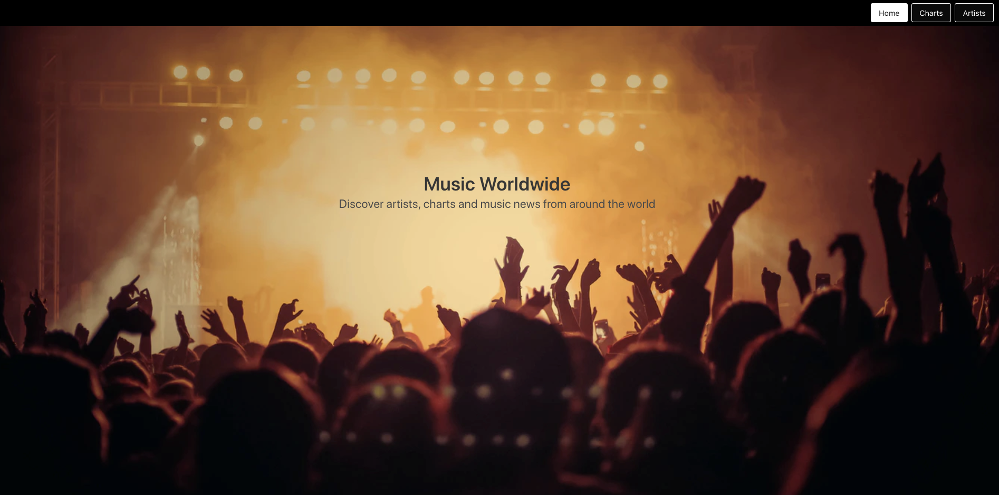
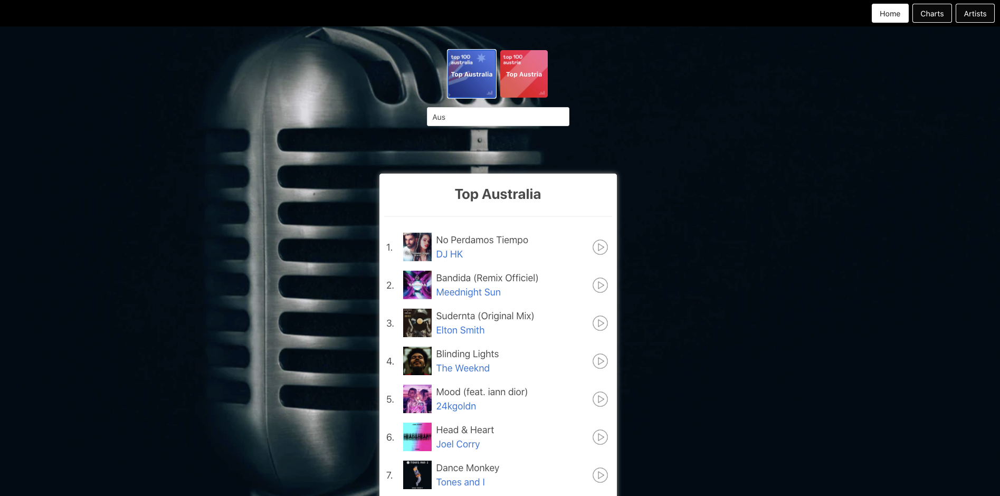
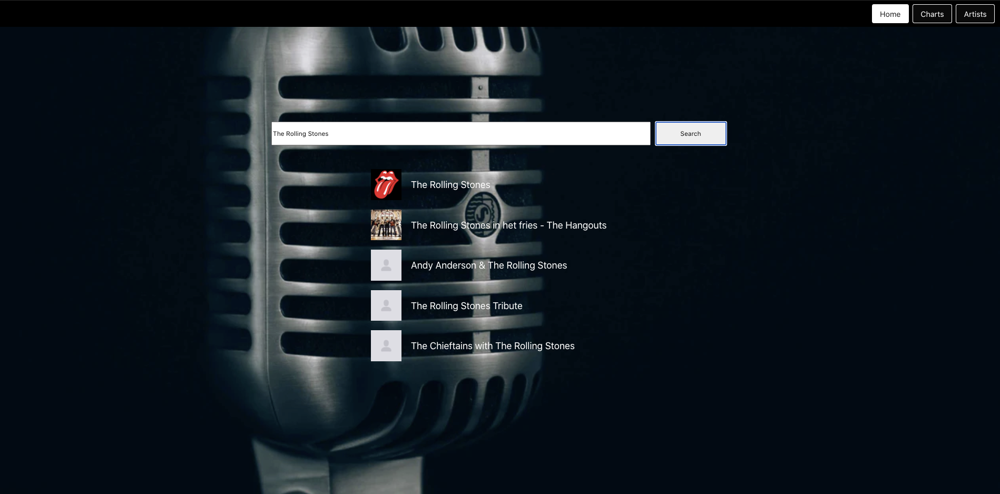
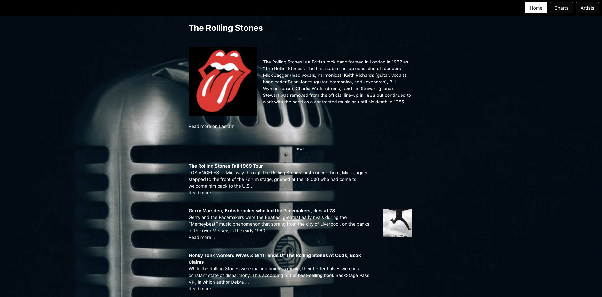

##  General Assembly, Software Engineering Immersive

# Project #2: Reacathon


## Overview
In teams of two we were asked to build a **React application** that consumes a **public API**.
We decided to build a music site where you could **discover top tracks and music news from around the world**.

[You can find the project here.](https://theorlbooth.co.uk/project-2/)

## Contributors 
* [Florian Wilisch](https://github.com/florian-wilisch)

## Technical Requirements

* **Consume a public API**.
* **Have several components** - At least one classical and one functional.
* **The app should include a router** - with several "pages".
* **Include wireframes**.
* Have **semantically clean HTML**.
* **Be deployed online** and accessible to the public.

## Technologies

* HTML
* CSS / SCSS
* JavaScript (ES6)
* JS DOM
* React
* npm
* Git and GitHub
* Ziteboard
* APIs
	* [Deezer](https://developers.deezer.com/api)
	* [Bing News](https://azure.microsoft.com/en-us/services/cognitive-services/bing-news-search-api/)
	* [Last.fm](https://www.last.fm/api)

## Approach

### Wireframes


### APIs 

We started with a plan to use two APIs: one to get the charts from around the world (Deezer) and one to get news on specific artists or bands (Bing News). As we were planing the app out added a third API to pull in artist/band biographies (Last.fm).

For **Deezer** we didn't need an authentication key but had to use a CORS proxi server to get any results back. That worked fine but causes some instabilities in the deployed project.

To call the API we opted for the axios fetch method which is triggered by a `useEffect` everytime a country (`currentPlaylist`) is selected:

```
useEffect(() => {
    async function fetchData() {

      const { data } = await axios.get(`https://cors-anywhere.herokuapp.com/https://api.deezer.com/playlist/${currentPlaylistID}`)
      updatePlaylistData(data)
    }
    fetchData()
  }, [currentPlaylist])
```
With the **Bing API** we faced the challenge to include a key in the header of the fetch request. This was finally resolved by studying the axios documentation and using an .env file.

```
const { data: dataNews } = await axios.get(
	`https://api.cognitive.microsoft.com/bing/v7.0/news/search?q=${artistName}&count=10&offset=0&mkt=en-us&safeSearch=Moderate`, {
	headers: {
		'Ocp-Apim-Subscription-Key': (process.env.Ocp_Apim_Subscription_Key)
	}
})
```
The third API - **Last.fm** - used an authentication key in the URL which we stored in the .env file and concatenated within our fetch, like so:

```
const { data: dataInfo } = await axios.get(
	`https://ws.audioscrobbler.com/2.0/?method=artist.getinfo&artist=${artistName}&api_key=${process.env.Last_API_Key}&format=json`
)
```

### Linking / Dynamic Page Creation

Having decided to use several APIs to get the information we wanted we also had to pass several pieces of information between pages. We decided to pass both the Artist name and the Artist ID through the url from the Charts page to the Artist page to avoid having to re-run one of the APIs.

```
<Route exact path="/project-2/charts/:artistName/:artistID" component={Artist} />
```

This however didn't solve the entire problem.  We decided to add a search for Artist/Band in the later stages of the project and had to call the API in order to get the ID from the search input.  It did allow us however to re-run the API on that page alone and pass the name and id back through to the page we had already constructed to show the artist information, therefore creating 2 paths to the same endpoint.


### Libraries
  
* [React-multi-carousel](https://www.npmjs.com/package/react-multi-carousel)
	
After battling with 'Pure-react-carousel' we decided to use the 'React-multi-carousel'. This required a lot more setup, and what seemed like endless StackOverflow rabbit holes trying to find the correct webpack.config.js module rules to set. However after we had managed to get it on the page it was much more responsive and easier to handle...albeit with more parameters.


```
<Carousel
        infinite={true}
        responsive={responsive}
        containerClass="carousel-container"
        itemClass="carousel-item-padding-40-px"
        centerMode={true}
      >
        {filterPlaylists().map((playlist, index) => {
          return <div key={index}><button className="playlist-button" style={{
            backgroundImage: `url(${playlist.image})`,
            backgroundPosition: 'center',
            backgroundSize: 'cover',
            backgroundRepeat: 'no-repeat'
          }} onClick={(event) => props.updateCurrentPlaylist(event.target.innerHTML)}>{playlist.name}</button></div>
        })}
      </Carousel>
```


* [React-spinners](https://github.com/davidhu2000/react-spinners)
(RingLoader)
  
This was very straighforward - good documentation and easy to implement.

  
```
const Loader = () => {
  return <div className="sweet-loading">
    <RingLoader
      css={`display: block;
    margin: auto;
    border-color: red;`}
      size={150}
      color={'#FF0000'}
      loading={true}
    />
  </div>
```


## Challenges / Victories
### Play buttons [Challenge]
On the Charts page the play/pause buttons gave us more trouble than we expected; for ex. all changing from play to pause when one was clicked, not stopping to play once one had been clicked, or needing various clicks to start or to stop.
 
We still have a know bug remaining with these buttons (see "Known bugs" section), but we resolved most of our issues by using a local vairable and some JS DOM techniques.

```
import pauseButton from '../images/pause.png'
import playButton from '../images/play.png'

[...]
let playState = false
[...]
 {
	playState = !playState

	{ playState ? document.querySelector(`#play${index}`).src = pauseButton : document.querySelector(`#play${index}`).src = playButton}

	document.querySelector('.player').src = `${track.preview}`
                
	{ playState ? document.querySelector('.player').play() : document.querySelector('.player').pause() }
}} />
[...]
<audio src='' className='player'></audio>
```
After reflection, inserting the images via a background-image in a CSS class might be a safer solution. The onClick would then simply switch the class. This might also help with our know bug.

### Setting up the search page in record time [Victory]
We felt very satisfied that we managed to pull the Artist Search page together in just about an hour by leveraging our code and learnings from building the Charts and Artist pages beforehand.
The API calls where similar, so our main challenge was the layout of the search results.

### Carousel
One of the biggest challenges for us was to get the carousel to work in an infinite loop without skipping from end to beggining. There seemed to be an issue with the number of slides shown vs the number of slides skipped onclick - this was finally resolved with a lot of trial and error of different aspects of the documentation. Unfortunately at the expense of the mobile responsiveness for the time being.
Due to the fact that we were filtering an array from an input and then mapping it into the carousel, another issue we faced was the output if there were fewer items to show than the number of slides set to be shown for the carousel. We got around this with an if statement returning the slides as individual items.

```
if (filterPlaylists().length < 8) {
    return <>
      <section className="playlists">
        <div className="small-playlists">
          {filterPlaylists().map((playlist, index) => {
            return <div key={index}><button className="playlist-button" style={{
              backgroundImage: `url(${playlist.image})`,
              backgroundPosition: 'center',
              backgroundSize: 'cover',
              backgroundRepeat: 'no-repeat'
            }} onClick={(event) => props.updateCurrentPlaylist(event.target.innerHTML)}>{playlist.name}</button></div>
          })}
        </div>
        <input className="input" placeholder="Search..." onChange={(event) => props.updateFilteredPlaylists(event.target.value)} value={props.filteredPlaylists} />
      </section>
    </>
``` 


## Screenshots


 

 


## Known bugs

#### Play buttons
When a play button is clicked, music is playing. When another play button is then clicked, the music switches but the first button image stays on the pause image rather than switching back.

#### CORS Error
Towards the final hours of our project we had real issues with the following error. However these were sporadic, unpredicatable and unexplainable as they were often solved with a hard refresh.
    "No 'Access-Control-Allow-Origin' header is present on the requested resource."

## Future Features

#### Mobile responsiveness 
We started out with this in mind and slowly drifted away from it having to hard code fixes for issues.  The time constraint played the biggest part in this, so it shouldnt be too hard to implement.

#### Artist section 
The APIs were were using were packed with information and it would have been nice to include more of this on the page.  Similar artists would have been the starting point. 

#### Back button
Currently when on the artist page there is no way of going back to the playlist that was previously selected, the Charts page reloads from default. 

#### Map
We had a romantic idea of having a responsive map instead of a carousel on the 'Charts' page - where one could chose the playlist by clicking on a country. Number of countries in the world vs number of playlists available aside, there were many reasons we didn't get round to this. But it would be nice to implement at some point in the future.

## Images
* Homepage background image by [Vishnu R Nair on Unsplash](https://unsplash.com/@vishnurnair)
* Background image for other pages by [Claus Grünstäudl on Unsplash](https://unsplash.com/@w18)
* Play/Pause buttons from [noun project](https://thenounproject.com/)
